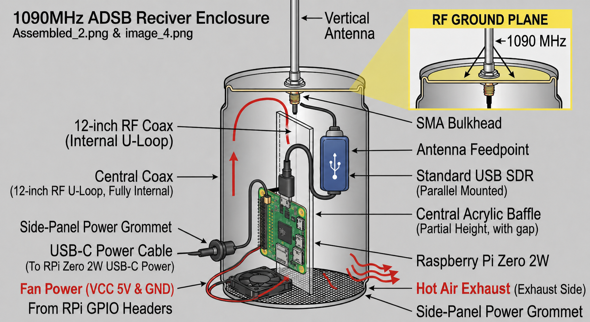
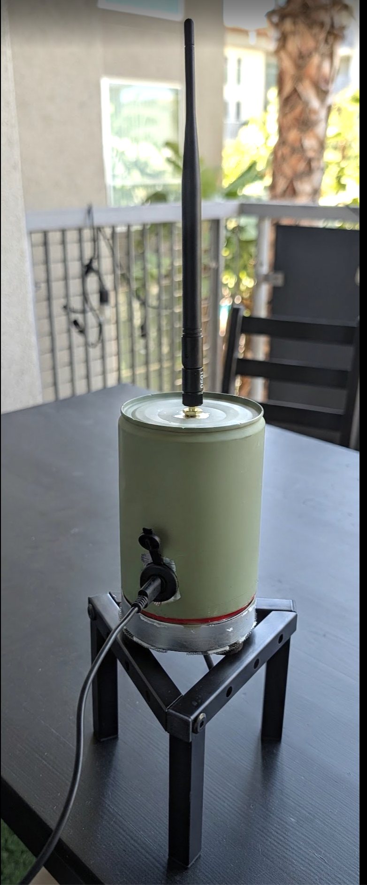
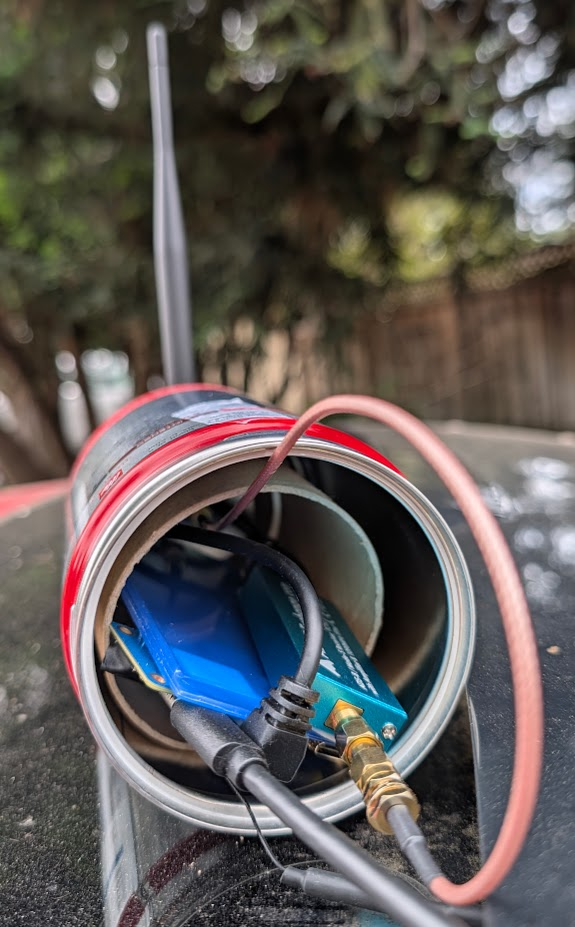
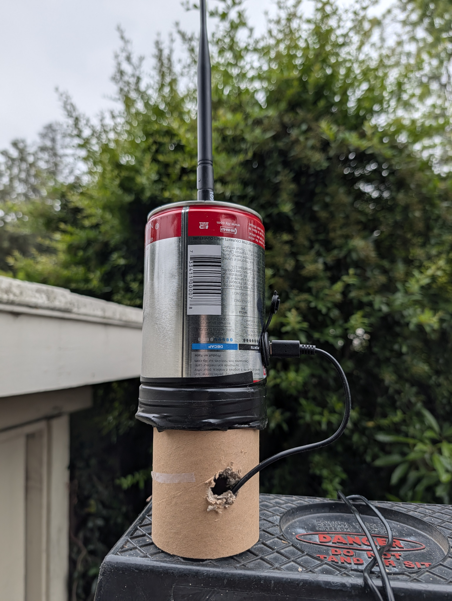
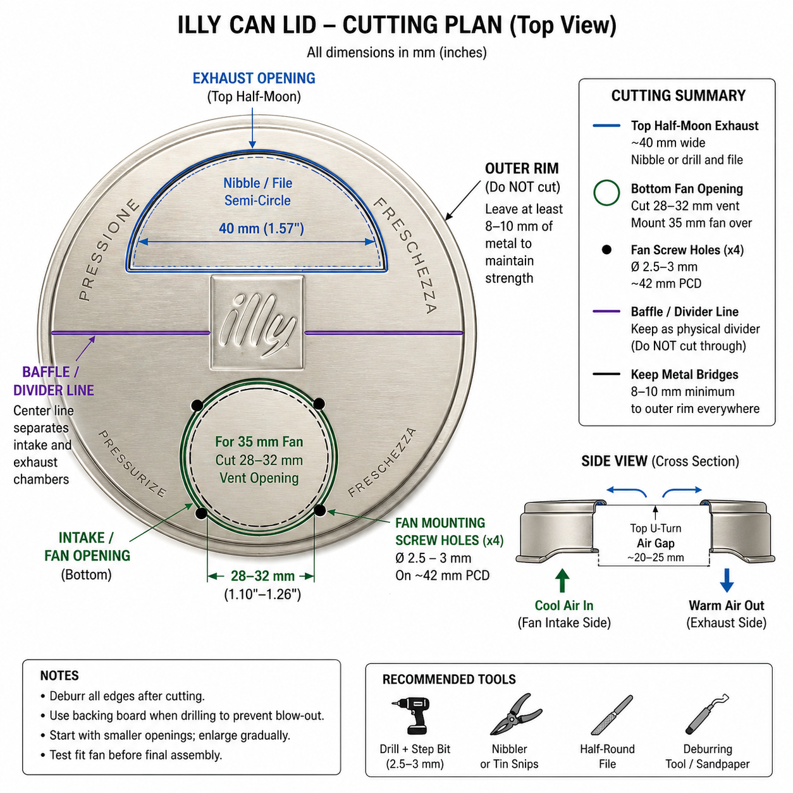

# SkyTing-1090

This project repurposes an Illy coffee tin into a high-performance, active-cooled Faraday cage and ground plane for an ADSB receiver.

 | 
 | 

---

## 🛠 Can Preparation

**Top (Solid Bottom) — Ground Plane**
- Drill a center hole in the solid metal base.
- Sand the can bottom interior and exterior near the hole to bare silver metal.
- Install the SMA Bulkhead.
- This serves as your 1090 MHz ground plane.

**Bottom (Lid) — Ventilation**
- Remove the plastic liner and sand the threads on both the can and the lid.
- A tight fit is not necessary; leave room for the steel mesh.

**RF Shielding**
- Screw the stainless steel mesh over the lid holes.
- Ensure it makes direct contact with the sanded lid metal to block 1 GHz noise.
- Measure DC continuity.

---

## 📐Internal Baffle & Mounting
The SkyTin 1090 uses a central Aviation Orange acrylic baffle to provide structural mounting for the hardware and to dictate the internal airflow path.

* Cut the sheet to 3.4" wide x 4.5" high (86mm x 114mm). Ensure it is short enough to leave a 1″ gap at the top for air to "U-turn."
* The 3.4" width provides a "gravity fit" inside the 3.5" illy can. If the sled rattles, apply a single strip of electrical tape to the edge of the acrylic for a perfect friction fit.
* Use the "score and snap" method with a utility knife and a straight edge. Score the line 5-10 times and snap it over a clean table edge.
* Use M2.5 Black Nylon Standoffs to secure the Orange Pi Zero 2W to the baffle.
* Use a 2.5mm or 3mm bit. Use a wood backing board while drilling to prevent the acrylic from cracking or "blowing out" the exit hole.
- **A Side:** Mount the Orange Pi Zero 2W to the baffle using M2.5 black nylon standoffs.
- **B Side:** Mount the SDR Stick (flipped 180° so the SMA port faces the top), using two black cable ties.
- Position the air intake fan at the bottom of the baffle (not centered, on one side) on the Orange Pi side and drill a 28-32mm hole for it in the lid under the fan. Leave room for screws.
- Drill and nibble a 40mm half circle in the lid on the air outflow side of the baffle.
- Insert the mesh and leave a "skirt" so it makes contact with the can and makes the lid fit tightly, now that the plastic lid liner is gone.

## ✂️ Lid Cutting Diagram
Not to scale; use your judgement.

---

## 🔌 Wiring It Up

| Connection | Details |
|---|---|
| **RF Path** | Connect a 12″ coax from the top SMA bulkhead down to the SDR's SMA port. |
| **Data Path** | Use a short USB-C to USB-A pigtail to connect the SDR to the Pi. |
| **Power Path** | Run a USB-C cable through a side-panel grommet; plug it directly into the Pi. |
| **Fan Power** | Connect the fan's red/black wires to GPIO Pin 2 (5 V) and Pin 6 (GND). If the fan is too loud at 5V, you can move the red wire to Pin 1 (3.3V) for a slower, quieter spin. |
| **WiFi Antenna** | Route the 3″ stub antenna through the mesh lid so it hangs vertically. |

---

## ✅ Final Check

- **No Shorts:** Ensure no metal solder points touch the can walls (the acrylic baffle helps here).
- **Tight Seal:** Screw the lid on firmly to engage the "Faraday" thread contact.
- **Weatherproofing:** If mounting outdoors, add a drip-loop to the power cable and silicone the top SMA nut.

---

## 💡 Result

You now have a weather-resistant, thermally managed, and RF-shielded ADSB node ready for mounting. Continue with software setup, already in progress.

# Actual Results
- Need to provide right-angle SMA and USB connectors to fit into can
- [https://www.amazon.com/dp/B0D47TSTV9](90 Degree USB 3.0 Adapter 2 Pack )
- [https://www.amazon.com/dp/B0DT88DNXY](CNARIO Coax 90 Degree Adapter Connector, SMA Male to Male Right Angle Connector)
- [https://www.amazon.com/dp/B0B2CP1G23](Geekworm Heatsink CPU Cooler for Raspberry Pi, 8PCS Copper Heatsinks with Thermal Conductive Adhesive)
- Used lunchbox divider and double-sided tape instead of the orange acrylic and standoffs
- Mounted fan with 2 standoffs due to hole constraints
- Mesh is on the outside, taped on edges, probably not good RF contact
- Fan is exhaust on Orange Pi side; intake is on SDR side (contrary to diagram)
 
## 🛒 Parts List

| Part | Link |
|---|---|
| 35mm Hydraulic Bearing Fan | [Amazon B07V35FR4Z](https://www.amazon.com/dp/B07V35FR4Z) |
| Orange Pi Zero 2W | [Amazon B0CHMGNY3W](https://www.amazon.com/dp/B0CHMGNY3W) |
| SDR+LNA+SAW: ADSBexchange.com Blue R820T2 RTL2832U, 0.5 PPM TCXO ADS-B SDR w/Amp and 1090 MHz Filter, Antenna, & Software on Industrial MicroSD | [ADSBexchange.com](https://store.adsbexchange.com/products/adsbexchange-com-r820t2-rtl2832u-0-5-ppm-tcxo-ads-b-sdr-w-amp-and-1090-mhz-filter-software-on-industrial-microsd) |
| Illy Coffee Can | [Amazon B00DTR9R9Q](https://www.amazon.com/dp/B00DTR9R9Q) |
| AMZDEPOT 6 Pack 6×8 Inch Wire Mesh, 20 Mesh Stainless Steel | [Amazon B0C5X98VTD](https://www.amazon.com/dp/B0C5X98VTD) |
| exgoofit SMA Bulkhead Adapter Female Coupler 2-Pack Waterproof Panel Mount Connector for RF Coaxial Antennas | [Amazon B0D66Y7C6J](https://www.amazon.com/dp/B0D66Y7C6J) |
| Coax Jumpers | [Amazon B07MJQWH8S](https://www.amazon.com/dp/B07MJQWH8S) |
| Power Supply | [Amazon B07W8XHMJZ](https://www.amazon.com/dp/B07W8XHMJZ) |
| Display Cable (for setup) | [Amazon B0DFYFSJDM](https://www.amazon.com/dp/B0DFYFSJDM) |
| Transparent Orange Cast Acrylic Sheet 1/8" | [Amazon B0D52G87L4](https://www.amazon.com/dp/B0D52G87L4) |
| M2.5 Black Male Nylon Stanf Hex Kit | [Amazon B0FPMC9917](https://www.amazon.com/dp/B0FPMC9917) |
| USB-C Bulkhead with Pigtail | [Amazon B0DRVKR5F4](https://www.amazon.com/dp/B0DRVKR5F4) |
| USB-C Male to USB-A Female OTG Pigtail - 10 inch /90 Degree | [Amazon B0C89VL9TH](https://www.amazon.com/dp/B0C89VL9TH) |
